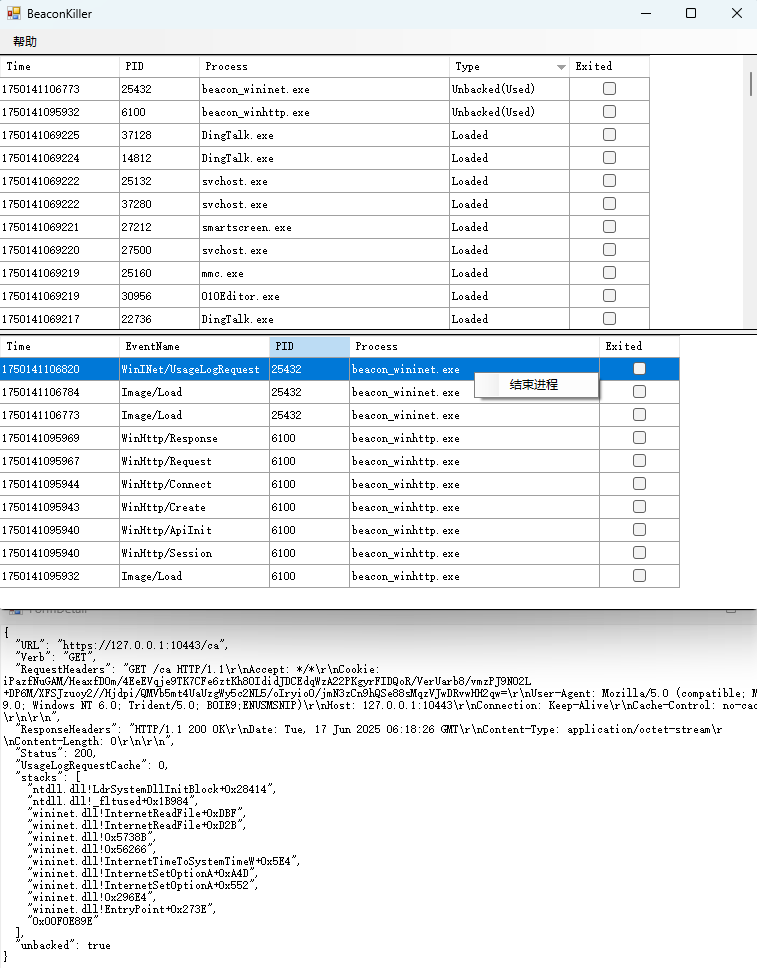

# BeaconKiller

针对http/https的beacon的检测工具，适合应急场景，快速定位beacon进程和通信URL

## 优势

相对于其他工具而言，由于仅使用etw技术，所谓稳定性更强

1. 不需要加载内核模块
1. 不需要注入dll

## 数据来源

1.进程相关/镜像相关事件:由Windows Kernel Trace提供
2.WinINet相关事件:由Microsoft-Windows-WinINet提供
3.WinHTTP相关事件:由Microsoft-Windows-WebIO提供

## 检测原理

由于beacon使用sRDI等shellcode加载技术，有以下特征

1.启动时:加载wininet.dll或winhttp.dll时堆栈回溯会出现unbacked
2.通信时:堆栈回溯会出现unbacked

## unbacked

即栈回溯地址无法对应镜像地址，而是动态申请的可执行内存地址

## 绕过

1. 启动时检测:已有一些绕过方法 
	* <https://xz.aliyun.com/news/18238>
2. 通信时检测:修改ntdll!EtwEventWrite,可阻断应用层的etw日志
	* <https://github.com/TheWover/donut/blob/47758d787209dd1744f58c140102ac91b649df16/loader/bypass.c#L365>

## 操作

* 右键进程/事件，可弹出结束进程菜单
* 双击进程查看启动参数
* 双击事件查看详情

## 截图

